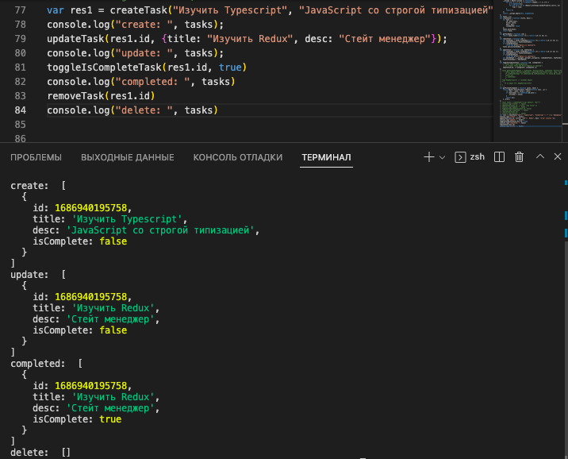

# To Do List

Код проекта доступен по ссылке - https://github.com/wctnz/to-do-Typescript

## Стек   

- React  
- TypeScript

В приложении типизированы функции 

Переопределен глобальный тип для метода Object.entries() 

## Функционал приложения: 

To Do List. Пользователь может добавлять новые задачи в список (createTask), изменять поля существующих задач(updateTask), в том числе поле isComplete (toggleIsCompleteTask), а также удалять задачи из списка (removeTask). 

    

